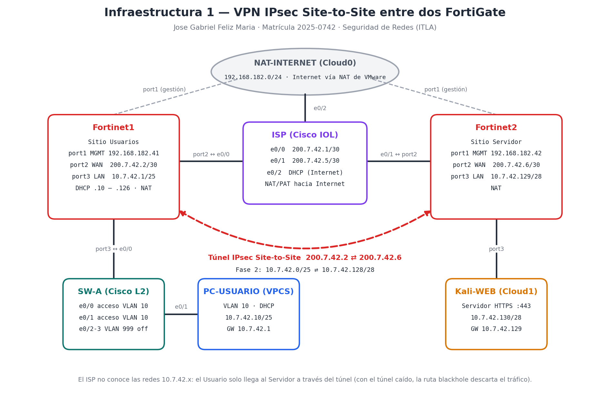
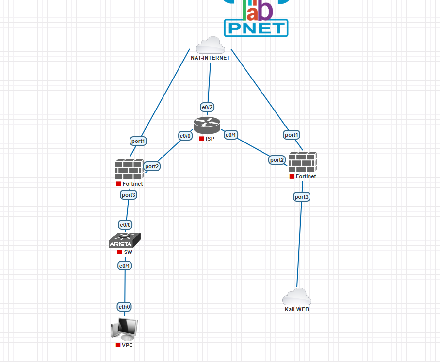
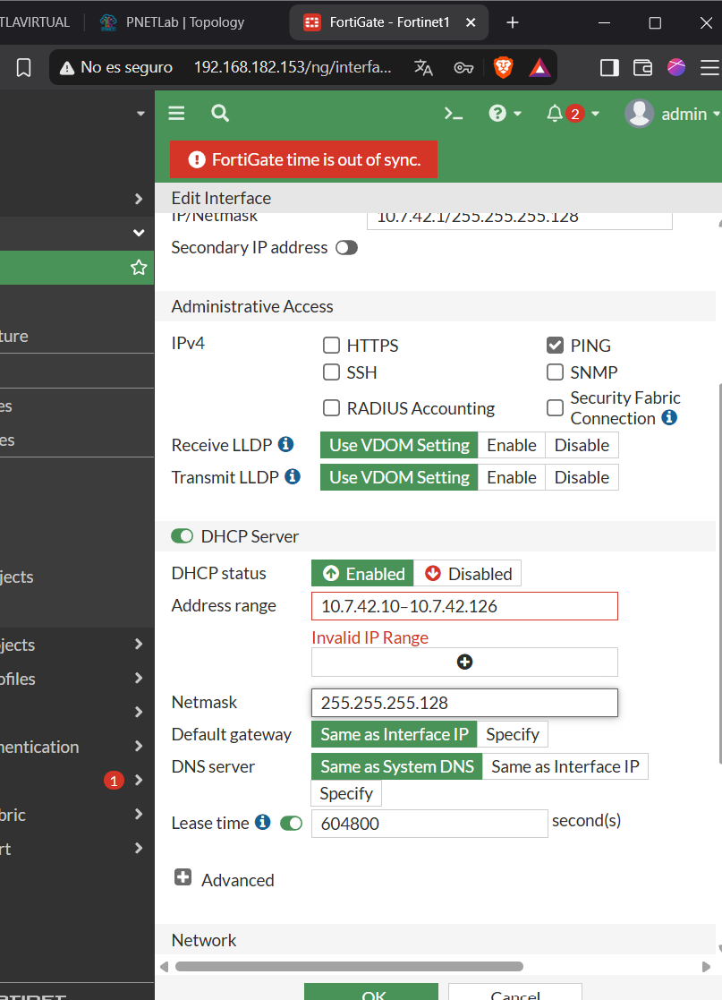
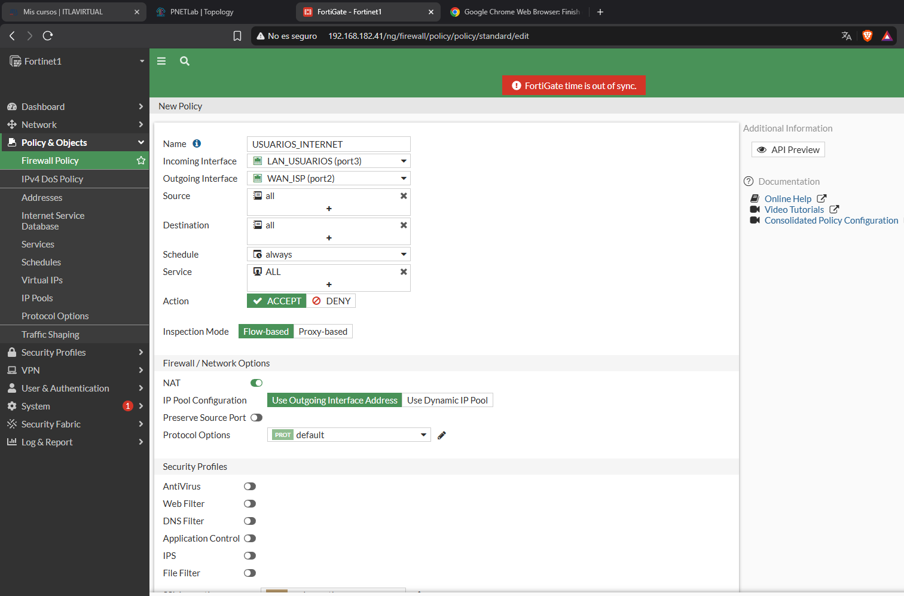
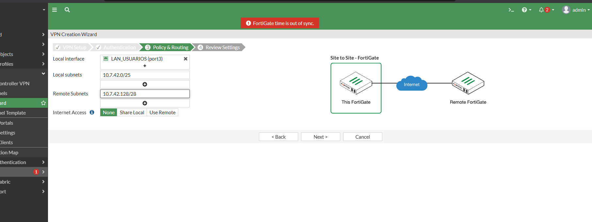
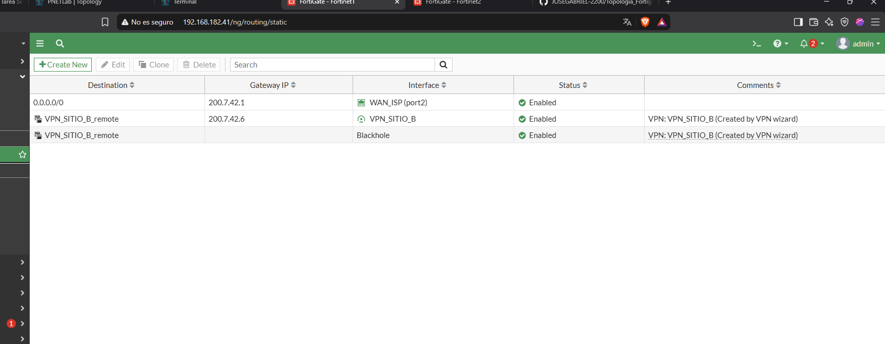
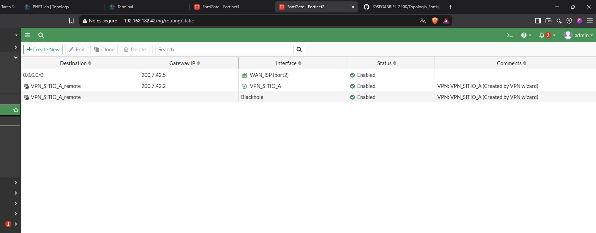
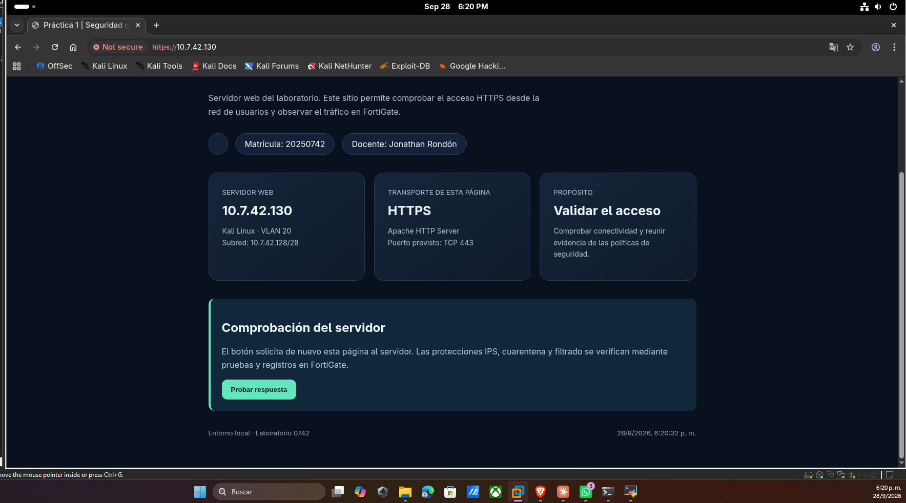
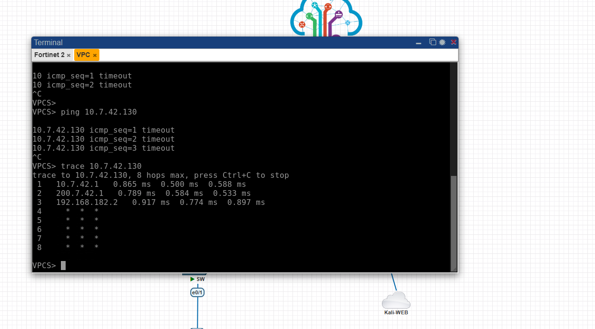
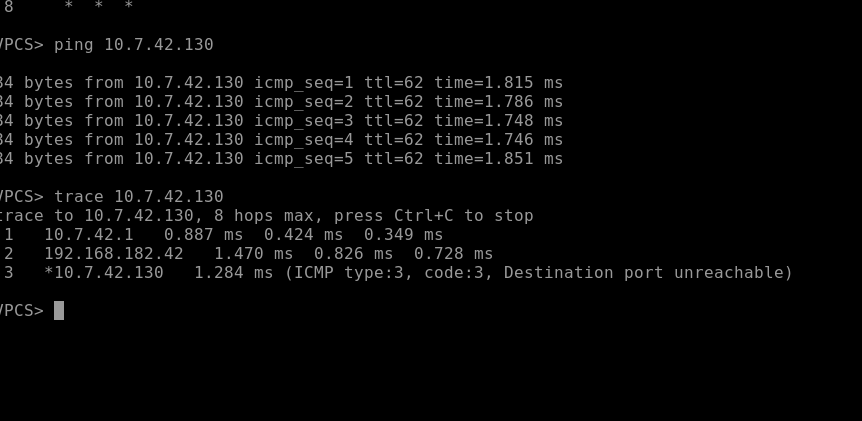

# Infraestructura 1 — VPN IPsec Site-to-Site entre dos FortiGate

**Jose Gabriel Feliz Maria · Matrícula: 2025-0742**
**Seguridad de Redes · ITLA**

---

## 🎥 Video Demostrativo

**▶️ [Ver demostración en YouTube](https://youtu.be/Cfp-Yw1Ay3Y)**

En el video se muestra la hora y fecha del sistema, el rostro y la voz del autor, y la demostración de que **el Usuario solo se comunica con el Servidor Web cuando el túnel VPN está activo**.

---

## 📋 Tabla de Contenido

1. [Propósito del Laboratorio](#1-propósito-del-laboratorio)
2. [Topología](#2-topología)
3. [Direccionamiento IP](#3-direccionamiento-ip)
4. [ISP (Cisco IOL)](#4-isp-cisco-iol)
5. [Switch SW-A (VLAN 10)](#5-switch-sw-a-vlan-10)
6. [Configuración de Red de los FortiGate (GUI)](#6-configuración-de-red-de-los-fortigate-gui)
7. [NAT hacia Internet](#7-nat-hacia-internet)
8. [VPN IPsec Site-to-Site (GUI)](#8-vpn-ipsec-site-to-site-gui)
9. [Servidor Web HTTPS (Kali)](#9-servidor-web-https-kali)
10. [Pruebas y Verificación](#10-pruebas-y-verificación)
11. [Scripts y Running-Configs](#11-scripts-y-running-configs)
12. [Evidencias (Capturas)](#12-evidencias-capturas)
13. [Notas y Limitaciones del Laboratorio](#13-notas-y-limitaciones-del-laboratorio)

---

## 1. Propósito del Laboratorio

Interconectar dos sitios separados por un proveedor de Internet (ISP) mediante un **túnel VPN IPsec Site-to-Site entre dos FortiGate**, cumpliendo dos objetivos de seguridad:

1. **Comunicar al Usuario con el Servidor a través del enlace VPN.** El tráfico entre la red de Usuarios (VLAN 10) y la red del Servidor Web viaja cifrado dentro del túnel, aunque el camino físico pase por el ISP.
2. **Comprobar que la comunicación solo fluye si el enlace VPN está activo.** El ISP no conoce las redes privadas `10.7.42.x`, y cada FortiGate tiene una **ruta blackhole** hacia la red remota: si el túnel cae, el tráfico se descarta en el propio FortiGate en lugar de salir en texto claro hacia Internet.

Toda la configuración y demostración de los FortiGate se realizó por **interfaz gráfica (GUI)**.

---

## 2. Topología

Topología montada en PNETLab:

| Equipo | Rol |
|---|---|
| **Fortinet1** | Firewall del sitio Usuarios: gateway y DHCP de la VLAN 10, NAT y extremo A de la VPN |
| **Fortinet2** | Firewall del sitio Servidor: gateway del servidor web, NAT y extremo B de la VPN |
| **ISP** | Router Cisco IOL que entrega las IPs públicas a los FortiGate y les da salida a Internet con NAT |
| **SW-A** | Switch Cisco IOL L2 con la VLAN 10 de Usuarios |
| **PC-USUARIO** | PC virtual (VPCS) en la VLAN 10, recibe IP por DHCP |
| **Kali-WEB** | Servidor web HTTPS (Apache) |
| **NAT-INTERNET** | Nube Cloud0 de PNETLab: Internet del ISP y red de gestión de los FortiGate |

---

## 3. Direccionamiento IP

Direccionamiento privado basado en la matrícula **2025-0742** (`10.7.42.0/24`) e IPs públicas del ISP en `200.7.42.0/29`.

| Red | Subred | Gateway | Uso |
|---|---|---|---|
| Usuarios (VLAN 10) | `10.7.42.0/25` | `10.7.42.1` (Fortinet1) | DHCP `10.7.42.10 – 10.7.42.126` |
| Servidor Web | `10.7.42.128/28` | `10.7.42.129` (Fortinet2) | Kali-WEB `10.7.42.130` |
| WAN Fortinet1 ↔ ISP | `200.7.42.0/30` | `200.7.42.1` (ISP) | IP pública Fortinet1 `200.7.42.2` |
| WAN Fortinet2 ↔ ISP | `200.7.42.4/30` | `200.7.42.5` (ISP) | IP pública Fortinet2 `200.7.42.6` |
| Gestión / Internet | `192.168.182.0/24` | `192.168.182.2` | port1 de los FortiGate y e0/2 del ISP |

| Equipo | Interfaz | IP |
|---|---|---|
| Fortinet1 | port1 (MGMT) | `192.168.182.41/24` |
| Fortinet1 | port2 (WAN_ISP) | `200.7.42.2/30` |
| Fortinet1 | port3 (LAN_USUARIOS) | `10.7.42.1/25` |
| Fortinet2 | port1 (MGMT) | `192.168.182.42/24` |
| Fortinet2 | port2 (WAN_ISP) | `200.7.42.6/30` |
| Fortinet2 | port3 (LAN_WEB) | `10.7.42.129/28` |
| ISP | e0/0 · e0/1 · e0/2 | `200.7.42.1/30` · `200.7.42.5/30` · DHCP |
| PC-USUARIO | eth0 | DHCP (`10.7.42.10/25`) |
| Kali-WEB | eth1 | `10.7.42.130/28` |

---

## 4. ISP (Cisco IOL)

- Entrega las IPs públicas `200.7.42.1/30` (hacia Fortinet1) y `200.7.42.5/30` (hacia Fortinet2).
- Sale a Internet por `e0/2` (DHCP) con **NAT/PAT** para las redes públicas `200.7.42.0/29`.
- **No tiene rutas hacia las redes privadas `10.7.42.x`**, igual que un proveedor real: por eso solo se puede llegar de un sitio al otro a través del túnel.
- Seguridad básica: `enable secret`, `service password-encryption`, banner, contraseña de consola, acceso remoto solo por **SSH v2** con usuario local y puerto sin uso apagado.

Script: [`scripts/ISP_config.txt`](scripts/ISP_config.txt) · Running-config: [`running-configs/ISP_running-config.txt`](running-configs/ISP_running-config.txt)

---

## 5. Switch SW-A (VLAN 10)

- **VLAN 10 (USUARIOS)** en `e0/1` (PC-USUARIO) y `e0/0` (hacia Fortinet1 port3), ambos en modo acceso con `portfast`.
- `e0/1` con **port-security** (máx. 2 MAC, sticky, violación *restrict*) y **BPDU Guard**.
- Puertos sin uso (`e0/2 – e0/3`) en la **VLAN 999** y apagados.
- Seguridad básica: `enable secret`, `service password-encryption`, banner y contraseña en consola y VTY.

Script: [`scripts/SW-A_config.txt`](scripts/SW-A_config.txt) · Running-config: [`running-configs/SW-A_running-config.txt`](running-configs/SW-A_running-config.txt)

---

## 6. Configuración de Red de los FortiGate (GUI)

| Paso (GUI) | Fortinet1 | Fortinet2 |
|---|---|---|
| System → Settings | Hostname `Fortinet1`, GMT-4, NTP FortiGuard | Hostname `Fortinet2`, GMT-4, NTP FortiGuard |
| Network → DNS | `8.8.8.8` / `8.8.4.4` | `8.8.8.8` / `8.8.4.4` |
| Network → Interfaces → port1 | `MGMT` · `192.168.182.41/24` · HTTP/HTTPS/PING | `MGMT` · `192.168.182.42/24` · HTTP/HTTPS/PING |
| Network → Interfaces → port2 | `WAN_ISP` · Role WAN · `200.7.42.2/30` | `WAN_ISP` · Role WAN · `200.7.42.6/30` |
| Network → Interfaces → port3 | `LAN_USUARIOS` · Role LAN · `10.7.42.1/25` · **DHCP Server** `.10 – .126` | `LAN_WEB` · Role LAN · `10.7.42.129/28` |
| Network → Static Routes | `0.0.0.0/0` → `200.7.42.1` (port2) | `0.0.0.0/0` → `200.7.42.5` (port2) |

---

## 7. NAT hacia Internet

**Policy & Objects → Firewall Policy**

| FortiGate | Política | Origen → Destino | NAT | Log |
|---|---|---|---|---|
| Fortinet1 | `USUARIOS_INTERNET` | port3 (LAN_USUARIOS) → port2 (WAN_ISP) | ✅ Outgoing Interface Address | All Sessions |
| Fortinet2 | `WEB_INTERNET` | port3 (LAN_WEB) → port2 (WAN_ISP) | ✅ Outgoing Interface Address | All Sessions |

---

## 8. VPN IPsec Site-to-Site (GUI)

**VPN → IPsec Wizard → Site to Site → FortiGate · No NAT between sites**

| Parámetro | Fortinet1 | Fortinet2 |
|---|---|---|
| Nombre | `VPN_SITIO_B` | `VPN_SITIO_A` |
| Remote IP (peer) | `200.7.42.6` | `200.7.42.2` |
| Outgoing interface | port2 (WAN_ISP) | port2 (WAN_ISP) |
| Autenticación | Pre-shared Key *(no publicada)* | Pre-shared Key *(la misma)* |
| Local interface | port3 (LAN_USUARIOS) | port3 (LAN_WEB) |
| Local subnet | `10.7.42.0/25` | `10.7.42.128/28` |
| Remote subnet | `10.7.42.128/28` | `10.7.42.0/25` |
| Internet Access | None | None |
| Propuestas Fase 1 / Fase 2 | `des-md5`, `des-sha1` | `des-md5`, `des-sha1` |

El asistente creó automáticamente en cada FortiGate:

- **Fase 1 y Fase 2** del túnel IPsec.
- Una **ruta estática** hacia la red remota por la interfaz del túnel.
- Una **ruta blackhole** hacia la red remota, que descarta el tráfico si el túnel está caído.
- Las **políticas** `vpn_..._local` (LAN → túnel) y `vpn_..._remote` (túnel → LAN), con registro de todas las sesiones.

---

## 9. Servidor Web HTTPS (Kali)

Apache con SSL escuchando en `https://10.7.42.130` (puerto 443). El Kali usa como gateway a Fortinet2 (`10.7.42.129`), configurado de forma permanente con NetworkManager.

---

## 10. Pruebas y Verificación

| # | Prueba | Resultado |
|---|---|---|
| 1 | `ip dhcp` en PC-USUARIO | ✅ `10.7.42.10/25`, gateway `10.7.42.1` |
| 2 | Ping/trace al servidor **sin VPN** | ✅ Falla: el tráfico sale por el ISP a Internet y se pierde |
| 3 | Estado del túnel (Dashboard → Network → IPsec) | ✅ **Up** en ambos FortiGate |
| 4 | Ping/trace al servidor **con VPN** | ✅ `10.7.42.1 → Fortinet2 → 10.7.42.130` |
| 5 | Logs Forward Traffic | ✅ `10.7.42.10 → 10.7.42.130` aceptado por las políticas VPN |
| 6 | Túnel deshabilitado → ping/trace | 🎥 Demostrado en vivo en el video: la comunicación se corta |
| 7 | Túnel habilitado de nuevo → ping/trace | 🎥 Demostrado en vivo en el video: la comunicación vuelve |
| 8 | `https://10.7.42.130` en el servidor | ✅ Página del laboratorio servida por HTTPS |

**Sin VPN:** el trace sale por el ISP (`200.7.42.1`) hacia Internet y nunca llega al servidor.

**Con VPN:** el trace llega al servidor atravesando el túnel.

---

## 11. Scripts y Running-Configs

| Archivo | Descripción |
|---|---|
| [`scripts/ISP_config.txt`](scripts/ISP_config.txt) | Configuración completa del router ISP |
| [`scripts/SW-A_config.txt`](scripts/SW-A_config.txt) | Configuración completa del switch SW-A |
| [`running-configs/ISP_running-config.txt`](running-configs/ISP_running-config.txt) | Running-config del ISP |
| [`running-configs/SW-A_running-config.txt`](running-configs/SW-A_running-config.txt) | Running-config del SW-A |
| [`running-configs/Fortinet1_running-config.conf`](running-configs/Fortinet1_running-config.conf) | Backup de configuración de Fortinet1 (GUI → Configuration → Backup) |
| [`running-configs/Fortinet2_running-config.conf`](running-configs/Fortinet2_running-config.conf) | Backup de configuración de Fortinet2 (GUI → Configuration → Backup) |

> En los backups de los FortiGate se redactaron (`<REDACTADO>`) los hashes de contraseñas, la clave precompartida de la VPN y las llaves privadas de los certificados, porque el repositorio es público.

---

## 12. Evidencias (Capturas)

| # | Archivo | Descripción |
|---|---|---|
| 01 | [`01_topologia_pnetlab.png`](screenshots/01_topologia_pnetlab.png) | Topología en PNETLab |
| 05 | [`05_fgt1_port3_lan_dhcp.png`](screenshots/05_fgt1_port3_lan_dhcp.png) | LAN de Usuarios con DHCP |
| 06 | [`06_fgt1_politica_nat_usuarios_internet.png`](screenshots/06_fgt1_politica_nat_usuarios_internet.png) | Política NAT de Usuarios |
| 08 | [`08_vpc_sin_vpn_ping_trace.png`](screenshots/08_vpc_sin_vpn_ping_trace.png) | Ping/trace **sin VPN** |
| 09 | [`09_fgt1_vpn_wizard_policy_routing.png`](screenshots/09_fgt1_vpn_wizard_policy_routing.png) | Asistente IPsec |
| 10 | [`10_vpc_con_vpn_ping_trace.png`](screenshots/10_vpc_con_vpn_ping_trace.png) | Ping/trace **con VPN** |
| 11 | [`11_fgt1_ipsec_tunel_up.png`](screenshots/11_fgt1_ipsec_tunel_up.png) | Túnel Up en Fortinet1 |
| 12 | [`12_fgt2_ipsec_tunel_up.png`](screenshots/12_fgt2_ipsec_tunel_up.png) | Túnel Up en Fortinet2 |
| 13 | [`13_fgt1_rutas_vpn_blackhole.png`](screenshots/13_fgt1_rutas_vpn_blackhole.png) | Rutas VPN y blackhole (Fortinet1) |
| 14 | [`14_fgt2_rutas_vpn_blackhole.png`](screenshots/14_fgt2_rutas_vpn_blackhole.png) | Rutas VPN y blackhole (Fortinet2) |
| 15 | [`15_fgt1_log_forward_traffic_vpn.png`](screenshots/15_fgt1_log_forward_traffic_vpn.png) | Logs de tráfico por la VPN (Fortinet1) |
| 16 | [`16_fgt2_log_forward_traffic_vpn.png`](screenshots/16_fgt2_log_forward_traffic_vpn.png) | Logs de tráfico por la VPN (Fortinet2) |
| 17 | [`17_kali_https_servidor_web.png`](screenshots/17_kali_https_servidor_web.png) | Servidor web HTTPS |

---

## 13. Notas y Limitaciones del Laboratorio

- **Licencia de evaluación de FortiGate VM:** limita la VM a 1 vCPU / 2 GB de RAM y solo permite cifrado débil. Por eso el asistente IPsec negoció el túnel con **DES (MD5/SHA1)** en Fase 1 y Fase 2; en un entorno de producción con licencia completa se usaría AES-256 con SHA-256 y grupos DH 14 o superiores. Por la misma limitación de cifrado, la GUI se administra por HTTP en la red de gestión (`port1`), algo aceptable solo en un laboratorio aislado.
- **Acceso inicial:** en un FortiGate nuevo solo el `port1` viene en DHCP. Para abrir la GUI la primera vez se habilitó el acceso administrativo HTTP en `port1` desde la consola; el resto de la configuración se hizo por GUI.
- **Red de gestión separada (out-of-band):** los `port1` están en una red de gestión independiente del tráfico de producción (`port2` WAN y `port3` LAN). El túnel VPN y el tráfico de Usuarios nunca usan la red de gestión.
- **Enlace switch ↔ Fortinet1:** el puerto del switch hacia el FortiGate va en modo acceso de la VLAN 10 (sin etiqueta); los Usuarios permanecen en la VLAN 10.
